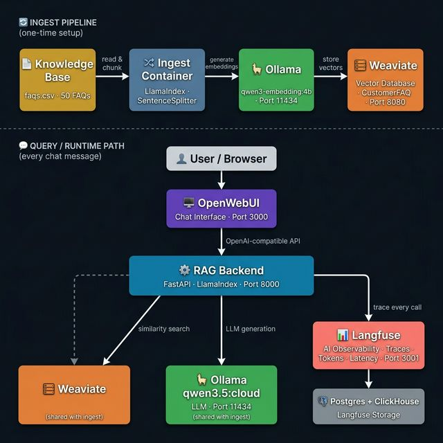

# 🚀 Langfuse Power Demo
### Customer Support Chatbot — AI Observability Showcase

A fully local, Docker-composable stack that demonstrates how **Langfuse** provides end-to-end observability over a production-grade RAG chatbot. Every interaction is traced, tokenized, scored, and visible in the Langfuse dashboard — side-by-side with your conversation in OpenWebUI.

---

## 🏗️ Architecture



---

## 🧱 Tech Stack

### 1. [OpenWebUI](https://github.com/open-webui/open-webui)
**Role:** Chat frontend  
OpenWebUI is an open-source, ChatGPT-like interface that connects to any OpenAI-compatible API. In this demo it serves as the user-facing chat window. Users type questions here; OpenWebUI forwards them to the RAG Backend.

---

### 2. [Ollama](https://ollama.com/)
**Role:** Local LLM + Embedding server  
Ollama runs large language models locally with no cloud dependency. It exposes an OpenAI-compatible HTTP API.

| Model | Purpose |
|---|---|
| `qwen3.5:cloud` | Main conversational LLM — generates answers |
| `qwen3-embedding:4b` | Converts text into vector embeddings for Weaviate |

Both models are **automatically pulled** on first `docker compose up`.

---

### 3. [Weaviate](https://weaviate.io/)
**Role:** Vector database (RAG knowledge store)  
Weaviate stores the embedded FAQ chunks in a collection called `CustomerFAQ`. At query time, the backend converts the user's question into a vector embedding and performs a similarity search to retrieve the most relevant FAQ entries as context.

---

### 4. [LlamaIndex](https://www.llamaindex.ai/)
**Role:** RAG orchestration framework  
LlamaIndex handles:
- **Ingestion**: reads `faqs.csv` → splits into chunks → generates embeddings → stores in Weaviate
- **Retrieval**: at query time, queries Weaviate for the top-3 similar chunks
- **Query Engine**: wraps retrieval + generation into a single pipeline

---

### 5. [Langfuse](https://langfuse.com/)
**Role:** LLM observability & AI ops platform  
Langfuse is the star of this demo. It captures:
- **Traces** — one per chat message, with full input/output
- **Spans** — nested timeline of retrieval and generation steps
- **Token usage** — prompt tokens, completion tokens, totals
- **Latency** — per-span timing breakdown
- **Scores** — automatic retrieval confidence score for hallucination detection
- **Sessions** — groups traces by user conversation
- **Prompt versioning** — the system prompt is registered as a named, versioned prompt

Langfuse runs locally via Docker (Postgres + ClickHouse backend).

---

### 6. Knowledge Base (`knowledge_base/faqs.csv`)
50 hand-crafted FAQ entries across 5 categories:

| Category | Topic examples |
|---|---|
| Account | Sign up, password reset, 2FA, profile settings |
| Billing | Payment methods, plans, upgrades, refunds, invoices |
| Technical | Browser support, file upload limits, API, data export |
| Integrations | Slack, Google Workspace, Zapier, Salesforce, Webhooks |
| Security | Encryption, SOC 2, GDPR, HIPAA, IP allowlist |

---

## ⚙️ Prerequisites

| Requirement | Notes |
|---|---|
| **Docker Desktop** | v24+ — allocate **16 GB RAM** minimum (Ollama models are large) |
| **Docker Compose v2** | Included with Docker Desktop |
| **~10 GB disk space** | For model weights + Docker images |
| **Internet access** | Only on first run (model pulls + image downloads) |

---

## 🛠️ Step-by-Step Setup

### Step 1 — Clone / navigate to the project

```bash
cd /path/to/langfuse-power-demo
```

### Step 2 — Configure environment

```bash
cp .env.example .env
```

The defaults in `.env.example` work out of the box. For production, rotate the secret keys.

### Step 3 — Start the full stack

```bash
docker compose up -d --build
```

This starts 8 containers in dependency order:
1. `postgres` + `clickhouse` (Langfuse storage)
2. `weaviate` (vector DB)
3. `ollama` (LLM server — pulls models on first boot)
4. `langfuse-server` (observability UI)
5. `ingest` (one-shot init job: embeds FAQs → Weaviate — exits when done)
6. `backend` (RAG API — waits for ingest to complete)
7. `open-webui` (chat frontend — waits for backend)

### Step 4 — Monitor startup

```bash
# Watch all containers come up
docker compose ps

# Watch Ollama pull the models (takes 5-10 min first time)
docker compose logs -f ollama

# Watch the knowledge base being embedded (runs after Ollama is ready)
docker compose logs -f ingest

# Watch the RAG backend start
docker compose logs -f backend
```

**Stack is ready when `docker compose ps` shows all services as `healthy` or `exited 0` (ingest).**

### Step 5 — Connect OpenWebUI to the RAG backend

> This is a one-time manual step — OpenWebUI doesn't support auto-configuration via environment on first boot.

1. Open **http://localhost:3000**
2. Skip sign-in (authentication is disabled for the demo)
3. Click your **avatar (top-right) → Settings → Connections**
4. Under **OpenAI API**, set:
   - **API Base URL**: `http://backend:8000/v1`
   - **API Key**: `demo-key`
5. Click **Save** ✅
6. In the model selector dropdown (top of chat), choose **"rag"**

### Step 6 — Open Langfuse (side-by-side)

1. Open **http://localhost:3001** in a second window/tab
2. Login: `demo@acmesaas.com` / `demo-password-123`
3. Navigate to **Traces** — every message you send in OpenWebUI will appear here in real time

---

## 🧪 Testing the Demo Scenarios

---

### ✅ Scenario 1: Happy Path (Normal RAG)

**What it tests:** Normal knowledge base retrieval + grounded answer generation.

**How to trigger:** Ask any question covered by the FAQ knowledge base.

**Example prompts to try:**
```
How do I reset my password?
What payment methods do you accept?
Is AcmeSaaS SOC 2 compliant?
How do I enable two-factor authentication?
Does AcmeSaaS have a mobile app?
Can I connect AcmeSaaS to Salesforce?
```

**What you see in Langfuse:**

1. Go to **Traces** → click the latest trace
2. You'll see a **timeline with two nested spans**:
   - `weaviate-retrieval` — how long it took to find relevant FAQs
   - `ollama-generation` — how long the LLM took to write the answer
3. Click the **Generation span** → **Usage** tab → shows prompt tokens, completion tokens, total
4. The trace **Input** shows the raw user question; **Output** shows the answer
5. Navigate to **Sessions** → you'll see the conversation grouped by session

**Langfuse features visible:** Prompt tracking, token usage, latency breakdown, session tracing

---

### 🐌 Scenario 2: Poor Latency (Slow Response)

**What it tests:** How Langfuse surfaces latency outliers and lets you isolate which step is slow.

**How to trigger:** Prefix your message with `[SLOW]`

**Example prompts:**
```
[SLOW] How do I export my data?
[SLOW] What is your uptime guarantee?
[SLOW] How do I cancel my subscription?
```

**What happens under the hood:** The backend injects a 4-second artificial sleep before the LLM call. This mimics a real-world scenario where a downstream service (e.g. a slow embedding server or overloaded LLM) causes latency spikes.

**What you see in Langfuse:**

1. Go to **Traces** → the slow trace will show a visibly longer **Duration** column
2. Click the trace → **Timeline view** → you'll see a third span called `artificial-latency-delay` taking ~4 seconds
3. Compare this timeline against a happy-path trace — the retrieval span is fast; the bottleneck is clearly isolated to the delay span
4. Use **Filters → Tag → slow** to surface all slow-mode traces in bulk
5. In a production setting, this is where you'd use Langfuse to pinpoint which service or model is causing slowness

**Langfuse features visible:** Latency breakdown per span, outlier detection via Duration column, tag-based filtering

---

### 🤔 Scenario 3: Hallucination Detection

**What it tests:** How Langfuse helps you detect when the LLM makes up information (answers questions not covered by the knowledge base).

**How to trigger:** Prefix your message with `[HALLUCINATE]`

**Example prompts:**
```
[HALLUCINATE] What is AcmeSaaS's stock price and P/E ratio?
[HALLUCINATE] Tell me about your real estate investment portfolio
[HALLUCINATE] Who are AcmeSaaS's top 5 competitors and their market share?
```

**What happens under the hood:** The backend intercepts the message, replaces it with an off-domain financial question (not in the knowledge base), and sends it to the LLM anyway. The LLM has no relevant context but may still generate a plausible-sounding (but fabricated) answer.

**What you see in Langfuse:**

1. Go to **Traces** → click the hallucinate-tagged trace
2. Under the `weaviate-retrieval` span → **Output** → `top_score` will be very low (< 0.5)
3. The trace will have a **Score** called `retrieval-confidence` with a value < 0.5 and comment: _"Low retrieval score — possible hallucination risk"_
4. Look at the `preview` field in the retrieval span — it will show unrelated FAQ chunks (or none), confirming no good context was found
5. The generated answer may still sound confident — this is the hallucination
6. Use **Filters → Tag → hallucinate** to find all such traces
7. In production, you'd hook this score to an alert or human review queue

**Langfuse features visible:** Retrieval confidence scoring, hallucination risk flagging, annotation/scoring system

---

## 🗺️ Langfuse Feature Reference

| Feature | Where to find it in the UI |
|---|---|
| **Prompt tracking** | Left menu → **Prompts** → `customer-support-v1` (versioned, editable) |
| **Token usage + cost** | Traces → any trace → Generation span → **Usage** tab |
| **Latency breakdown** | Traces → any trace → **Timeline** view (nested spans) |
| **Hallucination debugging** | Traces → filter `tag=hallucinate` → check **Scores** column |
| **User session tracing** | Left menu → **Sessions** → select any session → full conversation history |
| **Score / annotation** | Traces → any trace → **Scores** tab |

---

## 🔬 Direct API Testing (without OpenWebUI)

```bash
# Happy path
curl -s -X POST http://localhost:8000/v1/chat/completions \
  -H "Content-Type: application/json" \
  -d '{"model":"rag","messages":[{"role":"user","content":"How do I reset my password?"}]}' \
  | jq .choices[0].message.content

# Slow path (watch Langfuse latency spike)
curl -s -X POST http://localhost:8000/v1/chat/completions \
  -H "Content-Type: application/json" \
  -d '{"model":"rag","messages":[{"role":"user","content":"[SLOW] How do I export my data?"}]}' \
  | jq .

# Hallucination path (watch Langfuse score drop)
curl -s -X POST http://localhost:8000/v1/chat/completions \
  -H "Content-Type: application/json" \
  -d '{"model":"rag","messages":[{"role":"user","content":"[HALLUCINATE] What is your stock price?"}]}' \
  | jq .

# Verify Weaviate has the FAQ data
curl -s "http://localhost:8080/v1/objects?class=CustomerFAQ&limit=3" \
  | jq '.objects[].properties.question'

# Backend health check
curl http://localhost:8000/health
```

---

## 🛑 Teardown

```bash
# Stop containers but keep data volumes (faster restart next time)
docker compose down

# Full reset — removes all volumes (models, embeddings, traces)
docker compose down -v
```

---

## 📁 Project Structure

```
langfuse-power-demo/
├── .env.example                   Environment variable template
├── docker-compose.yml             8-service stack definition
├── README.md                      This file
│
├── knowledge_base/
│   └── faqs.csv                   50 FAQ entries across 5 categories
│
├── ingest/
│   ├── ingest.py                  LlamaIndex ingestion pipeline
│   ├── requirements.txt           Python dependencies
│   └── Dockerfile                 One-shot init container
│
└── backend/
    ├── app.py                     FastAPI RAG backend + Langfuse tracing
    ├── requirements.txt           Python dependencies
    └── Dockerfile                 Backend container
```

---

## 🩺 Troubleshooting

| Problem | Fix |
|---|---|
| Ollama models not pulled | `docker compose logs ollama` — wait for `✅ Ollama models ready` |
| Ingest container fails | Run `docker compose logs ingest` — Ollama may not be ready yet; re-run with `docker compose restart ingest` |
| OpenWebUI shows no models | Confirm backend is healthy: `curl http://localhost:8000/health` |
| Langfuse shows no traces | Check backend logs: `docker compose logs backend` |
| `qwen3.5:cloud` not found | This model requires Ollama ≥ 0.5. Run `docker compose pull ollama` to get the latest image |